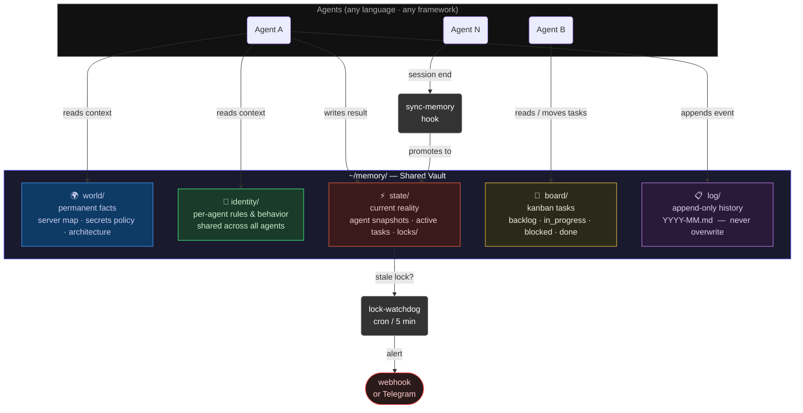
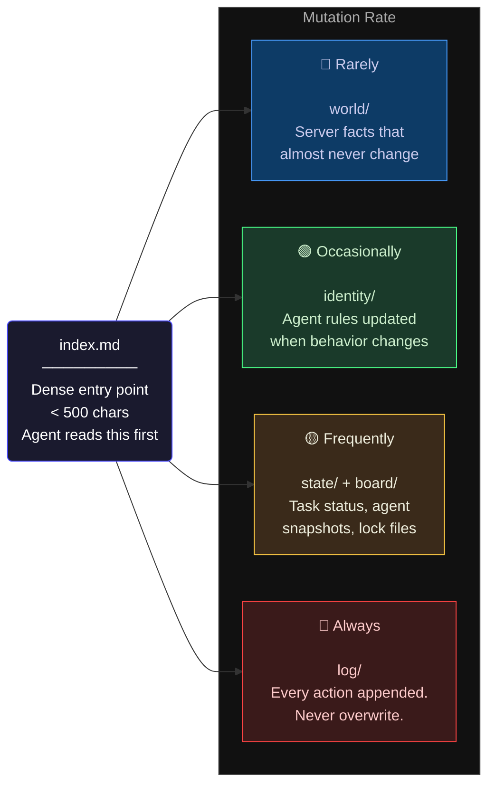

# AI Agent Memory Vault

A filesystem-based memory architecture for running multiple AI agents on any machine.

Works on: local machine, VPS, cloud VM, home server — anything with a shared filesystem.

**Full writeup on Medium:** *(link coming soon)*

---

## Architecture



---

## Vault layers



---

## The problem

Most AI agent frameworks give each agent its own isolated memory file. When you run multiple agents — or the same agent across sessions — they forget everything, repeat work, and have no shared context.

This is a pattern to fix that: one shared vault, four layers by mutation rate, readable by any agent in any language.

---

## Structure

```
bin/
  board              — kanban CLI: add/move/update/list tasks, all output JSON
  sync-memory        — promotes agent memory to vault on session end
  lock-watchdog.sh   — alerts when an agent lock goes stale (crash detection)

memory-vault/        — copy this to ~/memory/ on your machine
  index.md           — dense agent entry point, keep under 500 chars
  world/             — permanent facts (server map, secrets policy, architecture)
  identity/          — per-agent rules and behavior
  board/             — Obsidian-compatible kanban task files
  crons/             — master job registry (prevents duplicate crons)
  log/               — append-only event log
  state/             — current reality: agent snapshots + coordination locks
```

---

## The 4-layer model

| Layer | What lives here | Mutation rate |
|-------|----------------|---------------|
| `world/` | Machine facts, architecture, access policy | Rarely |
| `identity/` | Per-agent rules, tools, behavior | Occasionally |
| `state/` | Current tasks, agent snapshots, locks | Frequently |
| `log/` | Append-only event history | Always — never overwrite |

Separating by mutation rate keeps stable facts from getting polluted by volatile state, and volatile state from going stale.

---

## Quick start

```bash
# 1. Clone
git clone https://github.com/wassupjay/ai-agent-memory-vault
cd ai-agent-memory-vault

# 2. Copy vault template
cp -r memory-vault ~/memory
# Fill in ~/memory/world/server_map.md and identity/rules.md for your setup

# 3. Set up secrets vault
mkdir -p ~/.secrets && chmod 700 ~/.secrets
# Add your keys to ~/.secrets/master.env
chmod 600 ~/.secrets/master.env

# 4. Install CLI tools (Python 3.9+, no extra dependencies)
mkdir -p ~/bin
cp bin/board ~/bin/board && chmod +x ~/bin/board
cp bin/sync-memory ~/bin/sync-memory && chmod +x ~/bin/sync-memory
cp bin/lock-watchdog.sh ~/bin/lock-watchdog.sh && chmod +x ~/bin/lock-watchdog.sh
# Add ~/bin to PATH if not already
```

---

## Board CLI

No dependencies. Any agent calls it via shell. All output is JSON.

```bash
board add "Fix rate limiting" --priority high --agent myagent
board move TASK-001 in_progress
board update TASK-001 --log "found root cause"
board move TASK-001 done
board list
board list blocked
board next       # highest-priority unclaimed task
board show TASK-001
```

Tasks are plain Markdown in `~/memory/board/` — human-readable and Obsidian-compatible.

---

## Memory sync

Wire `sync-memory` into your agent's session-end hook. Configure via env vars:

```bash
export AGENT_NAME="myagent"
export AGENT_MEMORY_FILE="$HOME/.myagent/memory.md"
export VAULT_DIR="$HOME/memory"
```

```yaml
# Hermes example (config.yaml)
hooks:
  on_session_end:
    - command: AGENT_NAME=hermes AGENT_MEMORY_FILE=~/.hermes/memories/MEMORY.md ~/bin/sync-memory
```

Agent learns → session ends → vault updated → next agent picks it up.

---

## Multi-agent coordination

Drop a lock file before starting a task:

```bash
echo '{"task": "TASK-003", "started": "'$(date -u +%Y-%m-%dT%H:%M:%SZ)'"}' \
  > ~/memory/state/shared/locks/myagent.lock

# After done:
rm ~/memory/state/shared/locks/myagent.lock
```

`lock-watchdog.sh` checks every 5 minutes and alerts (via Telegram or any webhook) if a lock is older than 30 minutes.

```bash
# Add to crontab:
*/5 * * * * TELEGRAM_BOT_TOKEN=xxx TELEGRAM_CHAT_ID=yyy ~/bin/lock-watchdog.sh
```

---

## Obsidian

The vault is plain Markdown with `[[wikilinks]]`. Open `~/memory/` directly in Obsidian for a visual knowledge graph.

For a remote machine:

```bash
sshfs user@yourserver:~/memory ~/memory-remote
# Open ~/memory-remote as an Obsidian vault
```

---

## Adapting for your agent

1. Copy `memory-vault/identity/_agent_template.md` → `identity/youragent.md`
2. Edit `identity/rules.md` with shared behavior rules for all your agents
3. Point each agent at `~/memory/index.md` as its first read
4. Set `AGENT_NAME` + `AGENT_MEMORY_FILE` and wire `sync-memory` to session end

---

## License

MIT
